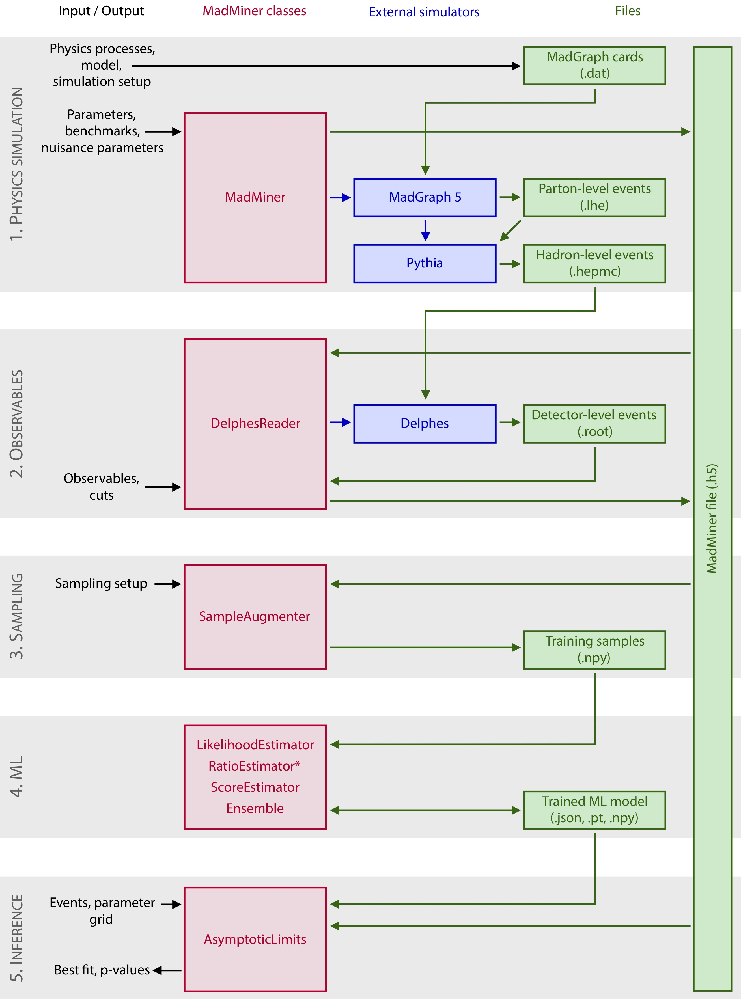
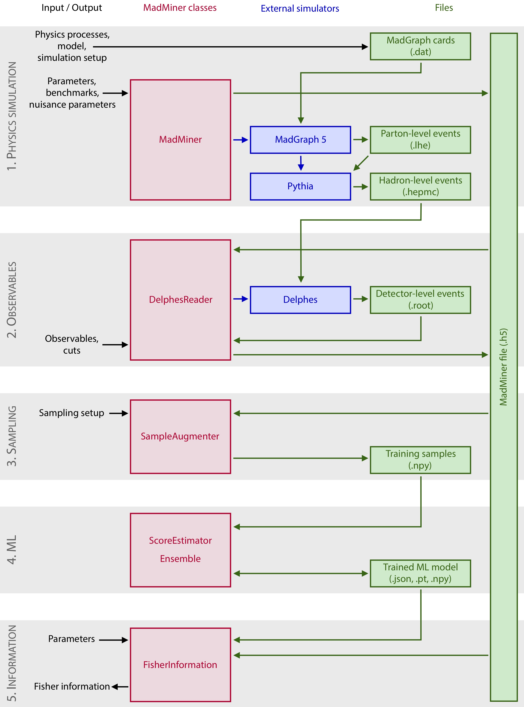
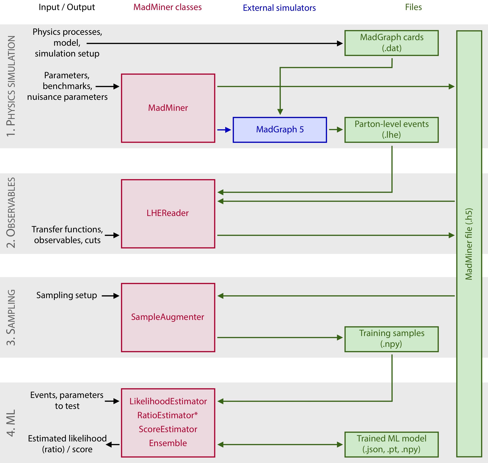

# Using MadMiner

## Tutorials

In our [GitHub repository](https://github.com/johannbrehmer/madminer) we provide a set of tutorials that are probably
a good way to get started with MadMiner.

As a starting point, we recommend to look at a 
[tutorial based on a toy example](https://github.com/johannbrehmer/madminer/tree/master/examples/tutorial_toy_simulator).
It demonstrates inference with MadMinier without spending much time on the more technical steps of running the simulation.

We then provide two sets of tutorials for the same real-world particle physics process. The difference between them is
that the [parton-level tutorial](https://github.com/johannbrehmer/madminer/tree/master/examples/tutorial_parton_level/) only requires running MadGraph. Instead of a proper
shower and detector simulation, we describe detector effects through simple smearing functions. This reduces the runtime
of the scripts quite a bit. In the [Delphes tutorial](https://github.com/johannbrehmer/madminer/tree/master/examples/tutorial_delphes/), we finally switch to Pythia and
Delphes; this tutorial is probably best suited as a starting point for phenomenological research projects. In most
other aspects, the two tutorials are identical.

[Other provided examples](https://github.com/johannbrehmer/madminer/tree/master/examples) show MadMiner in action in
different processes.

## Typical work flows

Here we illustrate the structure of data analysis with MadMiner in three examples.

### Exclusion limits

### Fisher information

### Parton-level analysis

## Package structure

- `madminer.core` contains the functions to set up the process, parameter space, morphing, and to steer MadGraph and
   Pythia.
- `madminer.lhe` and `madminer.delphes` contain two example implementations of a detector simulation and observable
   calculation. This part can easily be swapped out depending on the use case.
- In `madminer.sampling`, train and test samples for the machine learning part are generated and augmented with the
  joint score and joint ratio.
- `madminer.ml`  contains an implementation of the machine learning part. The user can train and evaluate estimators
  for the likelihood ratio or score.
- Finally,  `madminer.fisherinformation` contains functions to calculate the Fisher information, both on parton level
  or detector level, in the full process, individual observables, or the total cross section.

## Technical documentation

The madminer API is documented on here as well, just look through the pages linked on the left.